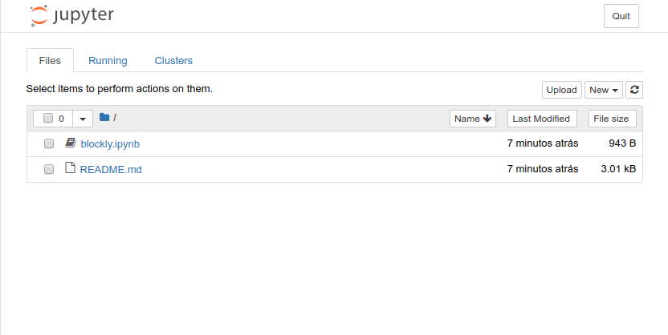
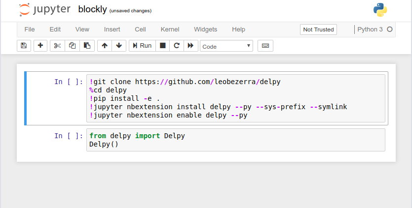
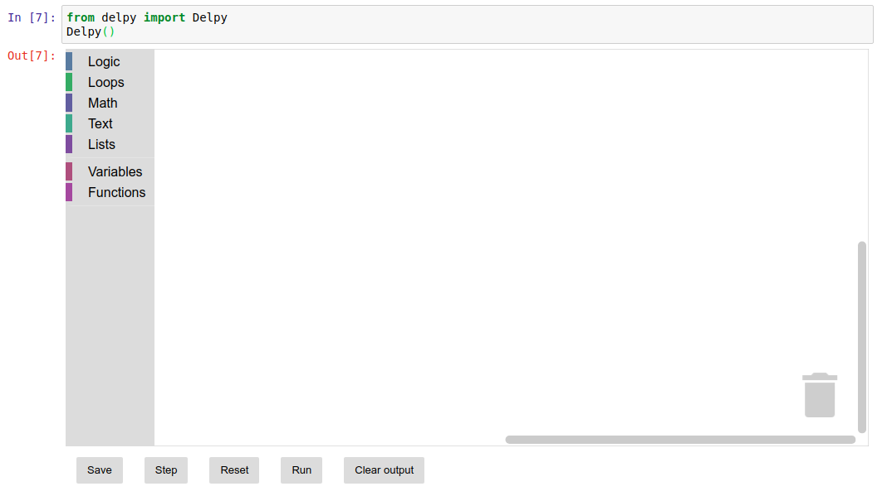

# Como executar o notebook através do binder

Esta é a opção mais simples, que não exige instalação de programas adicionais.

Clique na *badge* abaixo e ele irá te levar a uma outra página web, onde você encontrará os arquivos para executar o notebook.

Aguarde um pouco a página terminar de carregar e você verá uma página semelhante a página abaixo:

Quando a página estiver completamente carregada, clique no nome do notebook que deseja abrir. Ele irá te levar a uma nova página parecida com a página abaixo

Esta é a interface do *jupyter notebook*, porém antes de começar a usar, você precisa instalar as bibliotecas e tudo que é necessário para que funcione direitinho.

Para isso você deve selecionar a primeira célula (que começa com `!git clone ...`) e executá-la, você pode apertar `Alt + Enter` ou clicar na aba `Cell` e em seguida em `Run Cells`.

Por fim, você precisa recarregar a página, clique em `F5` no seu teclado.

*Ps: Tudo será instalado no ambiente virtual que você está utilizando, nada rodará localmente no seu computador.*

Agora que tudo está instalado, você só precisa executar a próxima célula do notebook e seu ambiente de aprendizado com o blockly estará pronto!

